# Active Directory Deployment Lab


> **Windows Server 2022 • AD DS • DNS • OUs • Security Groups • Windows 10 Client • Group Policy**

## 1. Project Overview

This project demonstrates the deployment of a small Windows Active Directory environment using VMware Workstation Pro.

A Windows Server 2022 virtual machine was configured as the domain controller for `lab.local`. Active Directory Domain Services and DNS were configured, an organizational-unit structure was created, users and security groups were provisioned, and a Windows 10 Pro client named `AHMED-PC1` was joined to the domain. A workstation Group Policy Object was also created and linked to the dedicated `Computers` OU.

## 2. Objectives

- Deploy Windows Server 2022 as a domain controller.
- Install Active Directory Domain Services.
- Create the `lab.local` forest/domain.
- Configure and verify DNS.
- Create the `AhmedLab` OU hierarchy.
- Create domain users and security groups.
- Configure departmental group membership.
- Deploy and join a Windows 10 Pro client.
- Verify domain authentication and DC connectivity.
- Create and link a workstation GPO.

## 3. Lab Architecture

| Machine | OS | IP | Role |
|---|---|---:|---|
| **DC01** | Windows Server 2022 Datacenter Evaluation | `192.168.107.10` | Domain Controller + DNS |
| **AHMED-PC1** | Windows 10 Pro | `192.168.107.131` | Domain-joined workstation |
| **VMware VMnet8** | NAT network | `192.168.107.0/24` | Virtual lab network |

**Domain:** `lab.local`
**DNS server for the client:** `192.168.107.10`
**VMware NAT gateway:** `192.168.107.2`

> The client must use the domain controller as its DNS server so that Active Directory domain and service records can be resolved correctly.

### Screenshot 0 — Main Server Manager dashboard

The main Server Manager dashboard was captured at the start of the lab to document the Windows Server 2022 management environment before the Active Directory configuration.

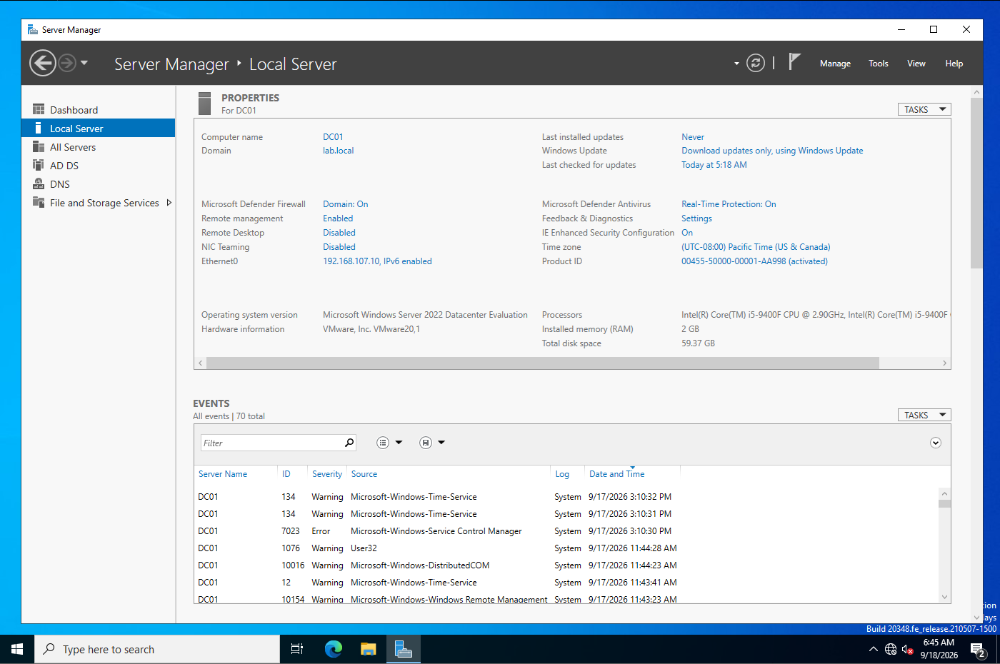

## 4. Active Directory and DNS

The Windows Server 2022 VM was promoted to a new forest using `lab.local`.

DNS Manager was used to verify the `lab.local` forward lookup zone and the DC01 record (`192.168.107.10`). The standard AD-integrated DNS structures were also present, including `_msdcs`, `_sites`, `_tcp`, `_udp`, `DomainDnsZones`, and `ForestDnsZones`.

### Screenshot 1 — DNS Manager — `lab.local` zone and DC01 record

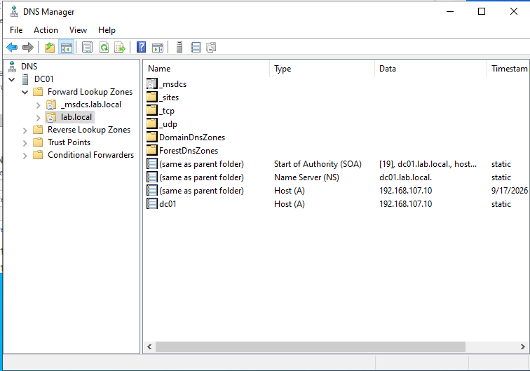

## 5. Organizational Unit Structure

The top-level `AhmedLab` OU was created with the following child OUs:

```text
AhmedLab
├── IT
├── HR
├── Sales
├── Users
├── Groups
├── Computers
└── Servers
```

### Screenshot 2 — AhmedLab OU structure

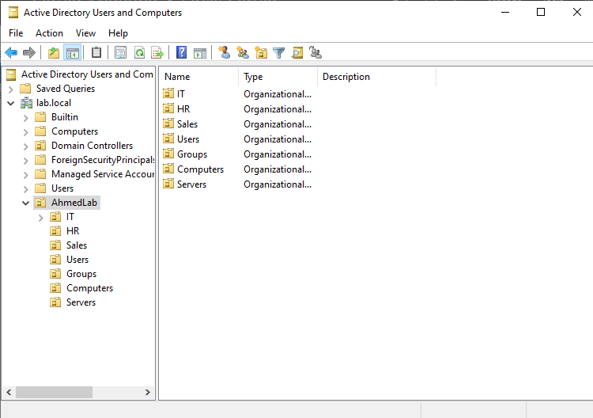

## 6. Users and Security Groups

### Users

| User | Department | Group |
|---|---|---|
| Ahmed Bahroun | IT | `IT-Team` |
| Sami Trabelsi | IT | `IT-Team` |
| Mariem Mansour | HR | `HR-Team` |
| Yassine Jaziri | Sales | `Sales-Team` |

### Security Groups

- `IT-Team`
- `HR-Team`
- `Sales-Team`

### Evidence

**Screenshot 3 — Security groups**

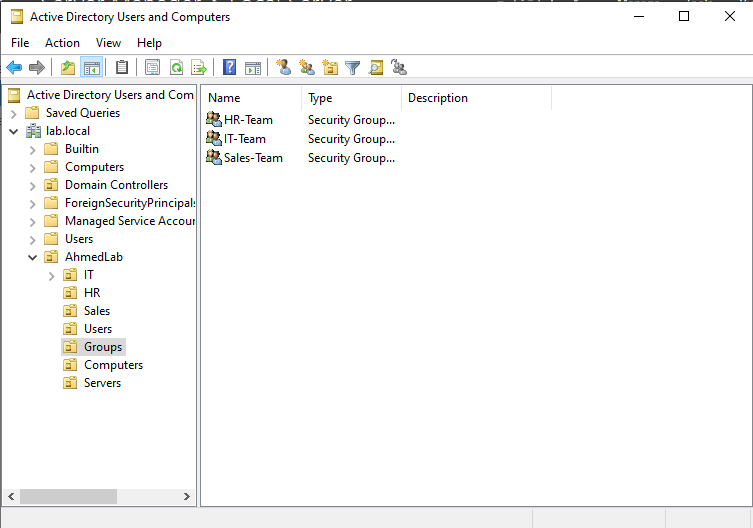

**Screenshots 4A–4D — User creation and departmental OU membership**

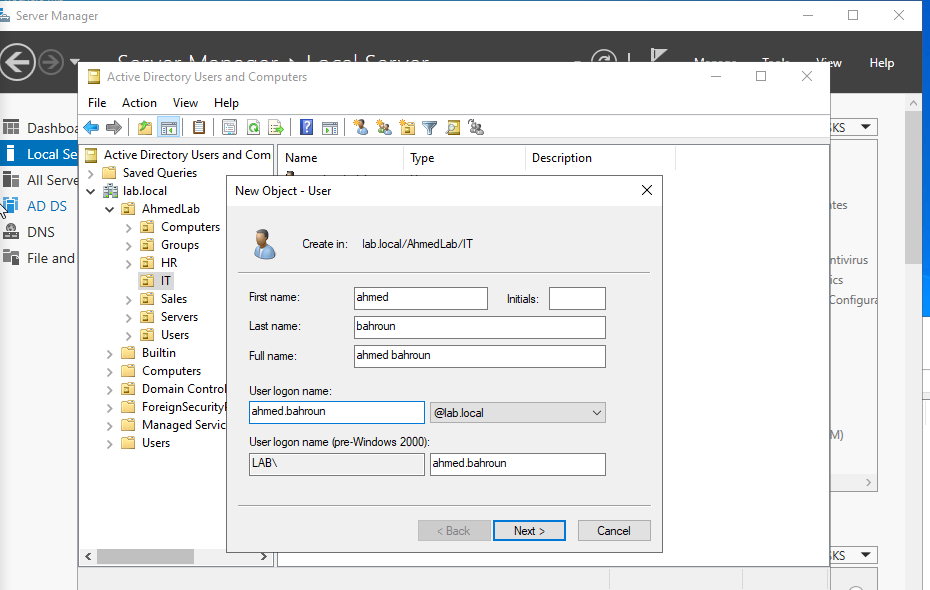
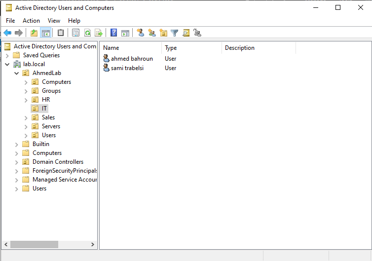
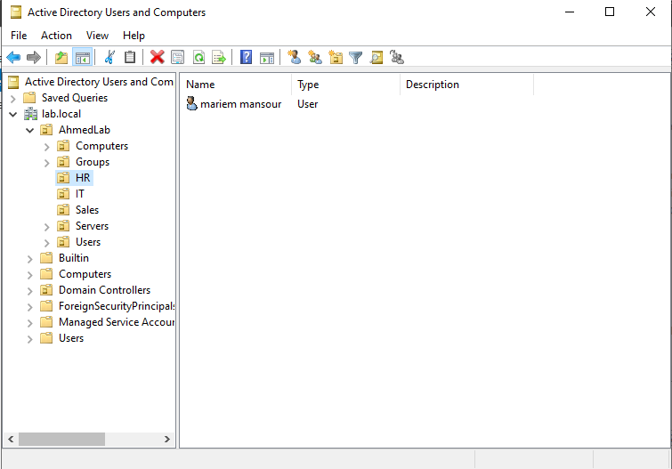
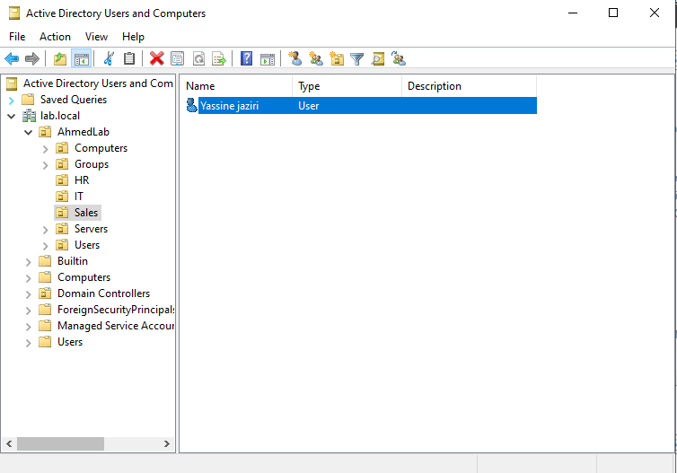

**Screenshots 5A–5C — Group membership verification**

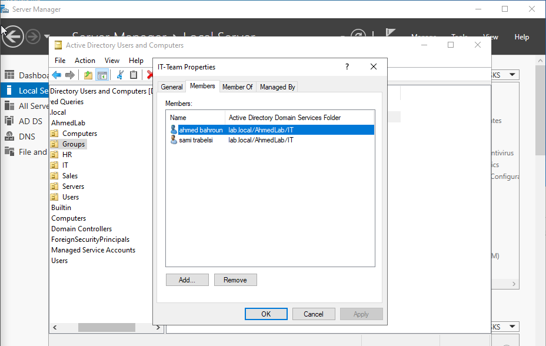
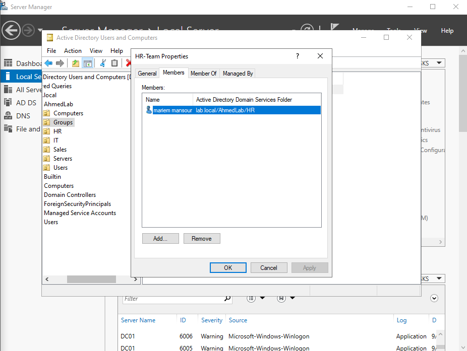
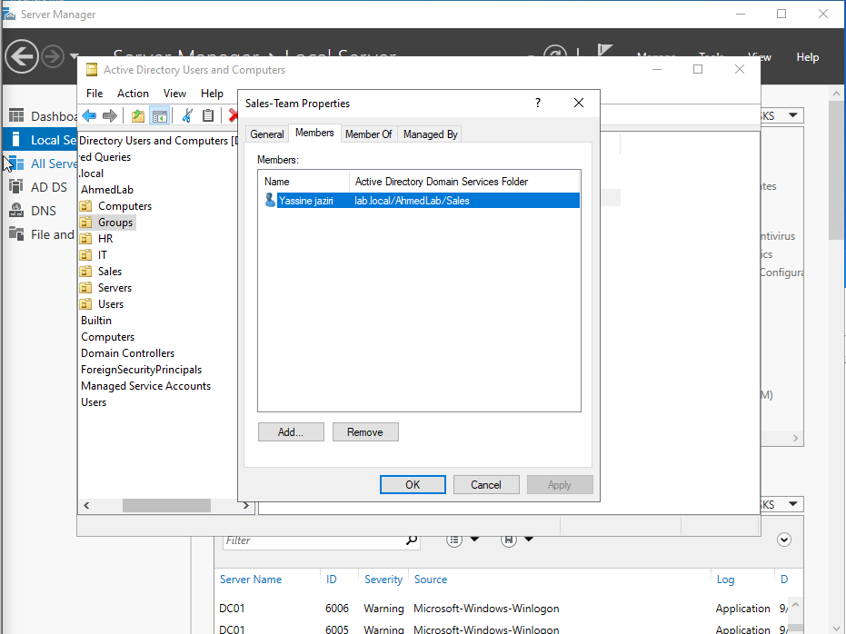

## 7. Windows Client Domain Join

A dedicated Windows 10 Pro VM named `AHMED-PC1` was connected to the VMware VMnet8 network.

The client configuration was:

```text
Hostname:       AHMED-PC1
IP address:     192.168.107.131
Subnet mask:    255.255.255.0
Gateway:        192.168.107.2
DNS server:     192.168.107.10
DNS suffix:     lab.local
```

The workstation successfully joined the `lab.local` domain. After restarting, a domain user successfully authenticated and the domain identity/logon server were verified.

### Evidence

**6A — Successful domain join**

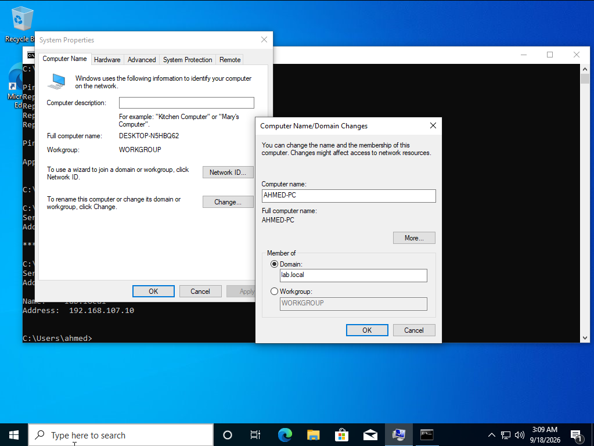

**6B — Computer/domain membership**

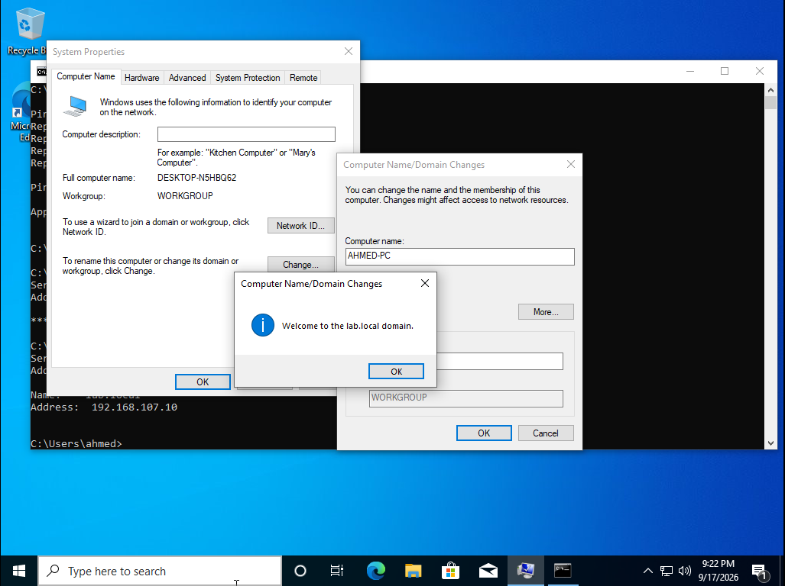

**6C — Successful domain-user login**

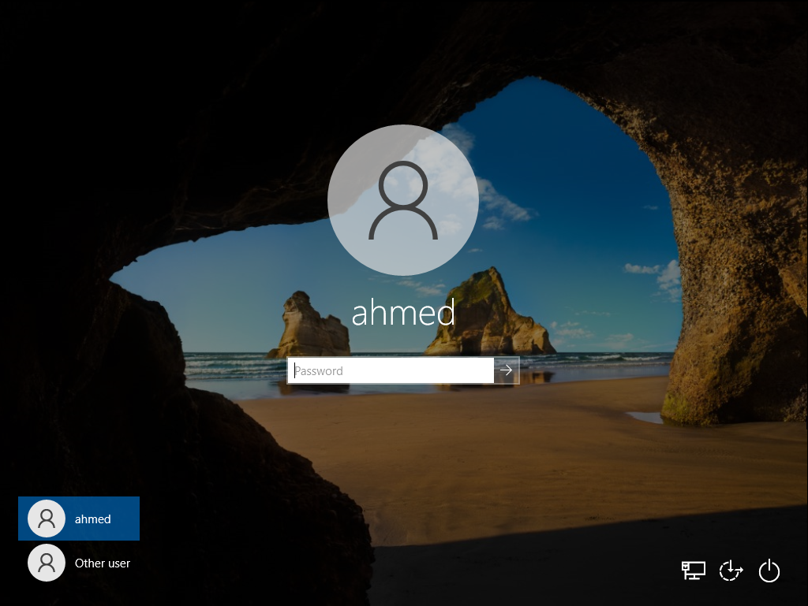

**6D — `whoami` / domain logon verification**

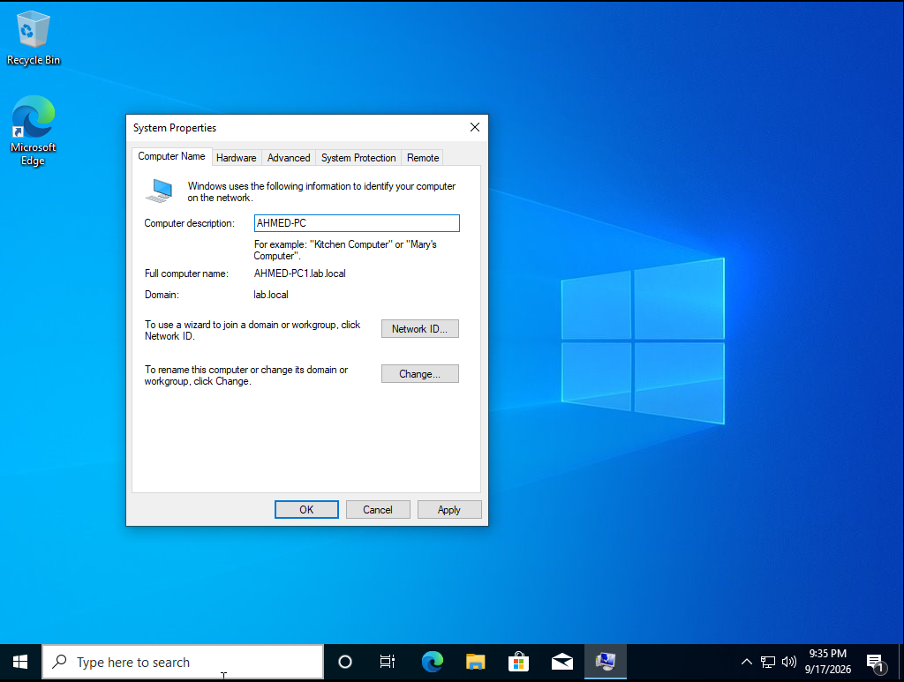

## 8. Group Policy

A workstation GPO named:

```text
Lab-Workstation-Policy
```

was created and linked to:

```text
AhmedLab
└── Computers
```

The configured policy demonstrates centralized workstation configuration:

```text
Computer Configuration
└── Policies
    └── Windows Settings
        └── Security Settings
            └── Local Policies
                └── Security Options
                    └── Interactive logon:
                       Display user information when the session is locked
```

### Screenshot 7A — Lab-Workstation-Policy linked to `AhmedLab → Computers`

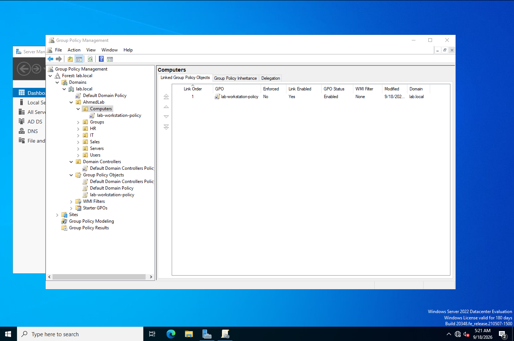

## 9. Validation

| Area | Result |
|---|---|
| DNS | `lab.local` and DC01 DNS records verified |
| Network | Client communicates with DC01 |
| Domain Join | `AHMED-PC1` successfully joined `lab.local` |
| Authentication | Domain user successfully logged in |
| Identity | Domain/logon-server information verified |
| AD Organization | Users and groups organized by department |
| Group Policy | GPO created and linked to workstation OU |

## 10. Screenshot Index

| Screenshot | Evidence | Filename |
|---|---|---|
| 0 | Main Server Manager dashboard | `00-server-manager.png` |
| 1 | DNS Manager / `lab.local` | `01-dns-manager.png` |
| 2 | `AhmedLab` OU structure | `02-ou-structure.png` |
| 3 | Security groups | `03-security-groups.png` |
| 4A | Ahmed Bahroun user creation | `04a-user-creation.png` |
| 4B | IT OU / users | `04b-it-ou-users.png` |
| 4C | HR OU / user | `04c-hr-ou-user.png` |
| 4D | Sales OU / user | `04d-sales-ou-user.png` |
| 5A | IT-Team membership | `05a-it-team-membership.png` |
| 5B | HR-Team membership | `05b-hr-team-membership.png` |
| 5C | Sales-Team membership | `05c-sales-team-membership.png` |
| 6A | Successful domain join | `06a-domain-join.png` |
| 6B | Computer/domain membership | `06b-domain-membership.png` |
| 6C | Domain-user login | `06c-domain-user-login.png` |
| 6D | `whoami` / logon verification | `06d-whoami-verification.png` |
| 7A | GPO linked to `AhmedLab → Computers` | `07a-gpo-link.png` |

## 11. Conclusion

The completed lab demonstrates a functional small-scale Active Directory environment covering:

- Active Directory Domain Services
- DNS
- Organizational Units
- User administration
- Security groups and membership
- Windows domain joining
- Domain authentication
- Group Policy management

The environment provides a practical demonstration of foundational Windows domain administration suitable for an academic project or portfolio.
